<p align="center">
  <picture>
    <source media="(prefers-color-scheme: dark)" srcset="./assets/agent-powerups-header-dark.svg">
    <source media="(prefers-color-scheme: light)" srcset="./assets/agent-powerups-header-light.svg">
    
  </picture>
</p>

<h1 align="center">Agent Powerups</h1>

<p align="center">
  <strong>Oh My Zsh for coding agents.</strong>
</p>

<p align="center">
  <a href="https://www.npmjs.com/package/agent-powerups/v/latest">
    
  </a>
  <a href="https://www.npmjs.com/package/agent-powerups/v/latest">
    
  </a>
  <a href="https://github.com/yeaight7/agent-powerups/actions/workflows/ci.yml">
    
  </a>
  <a href="https://github.com/yeaight7/agent-powerups/releases">
    
  </a>
  <a href="https://github.com/yeaight7/agent-powerups/blob/main/LICENSE">
    
  </a>
    
  <a href="https://github.com/yeaight7/agent-powerups/stargazers">
    
  </a>
</p>

<p align="center">
  <a href="#quickstart">Quickstart</a>
  ·
  <a href="#agent-quickstart">Agent Quickstart</a>
  ·
  <a href="#plugins">Plugins</a>
  ·
  <a href="./docs/installation.md">Installation</a>
  ·
  <a href="./docs/security-model.md">Security Model</a>
  ·
  <a href="./CONTRIBUTING.md">Contributing</a>
</p>

Agent Powerups is an Oh My Zsh-style collection of reusable skills, slash commands, MCP configs, hooks, AGENTS.md templates, and workflows for coding agents.

Today, this repo ships:

- reusable skills
- safe local CLI (`apx`) with runnable local checks
- persistent Gemini relay for always-active secondary-agent delegation
- validation and requirement-check scripts
- verified local GitHub MCP check, smoke, and install flow
- command, hook, workflow, examples, and AGENTS.md templates
- plugins with native install, marketplace metadata, and `apx plugins` inspection (`apx plugins list`)
- user-intent profiles with `apx profiles` for curated skill/plugin sets

Native install is direct for humans. Safety boundaries stay around external tools, secrets, shell profiles, and MCP enablement.

## What Is Here

|  Path  | Status | Notes |
|--------|--------|-------|
|  `skills/`  | shipped | Reusable agent workflows such as `systematic-debugging` and `writing-plans` |
|  `mcp/`  | shipped | Local-first GitHub MCP config with check, smoke, and explicit install commands |
|  `agents-md/`  | shipped | Starter AGENTS.md templates |
|  `commands/`  | shipped | Review-first command prompts plus safe runnable checks |
|  `hooks/`  | shipped | Review-before-use hook recipes plus safe runnable checks |
|  `workflows/`  | shipped | Scenario guides |
|  `plugins/`  | shipped | Plugins with local-first discovery, validation, native install, and marketplace metadata (`apx plugins list`) |
|  `scripts/`  | shipped | Validation and tool-check helpers for this repo |
|  `examples/`  | shipped | Minimal safe setup examples |

## Agent Quickstart

If you are an agent working in a repo with Agent Powerups available, route tasks to capabilities yourself instead of waiting to be told:

1. **Match first.** On Claude Code the host already lists skills natively — match the task to the narrowest fitting skill (plus obvious fits like `no-fluff`). On Codex, Gemini, or generic agents, start with `apx discover`.
2. **Discover the rest** — anything not natively loaded (MCP configs, hooks, AGENTS.md templates, installed-only assets):

   ```sh
   apx discover "<the user's task>" --target <codex|claude-code|gemini|generic> --json
   apx info <chosen-asset>     # what it is, when to use it, source path, next action
   ```

3. **Read, apply, verify.** Read the asset's `SKILL.md` (or file) before applying it; run `apx check <asset>` only if it declares external requirements; then verify the result against the task.
4. **Gate risky assets.** MCP configs and hooks are review-before-use — surface them for approval, never auto-enable.

## Quickstart

### Using npm (Recommended)

```sh
npm install -g agent-powerups
apx install claude --full
```

This installs the `apx` CLI globally and runs a full Claude Code setup — copies skills, plugins, and commands into `~/.claude/` and patches your `CLAUDE.md`. Use `--dry-run` to preview changes first.

### Using Source Checkout (Development)

1. Clone and install deps:

```sh
git clone https://github.com/yeaight7/agent-powerups.git
cd agent-powerups
npm install
```

2. Build CLI and install globally:

```sh
npm run build
npm link
```

3. Check repo health:

```sh
apx doctor
apx doctor --full
```

4. Discover relevant powerups and browse the catalog:

```sh
apx discover "fix a failing test regression" --target codex
apx inventory --target codex --json
apx list
apx list --json --verbose
apx info markitdown-file-intake
apx commands run ship-check
apx hooks run no-secrets-preflight --all
apx mcp check github-local --target generic
apx mcp smoke github-local --json
apx mcp install github-local --target codex --dry-run
```

5. Manual native install:

```sh
apx install codex --dry-run
apx install codex
apx install claude
apx install gemini
apx install codex --full
apx install codex --verbose
```

Default native install copies all root skills and plugins into the selected agent root and writes a `discovery-index.json` beside them. Human output shows counts by default; use `--verbose` for per-file paths. `--full` also stages support assets and another discovery index under `agent-powerups/`, then updates existing global instructions with a backup.

6. Work with plugins:

```sh
apx plugins list
apx plugins info dev-vitals
apx plugins validate --all
apx plugins install dev-vitals --target codex --dry-run
```

6. Try a local advisor CLI and save an artifact:

```sh
apx ask-codex "Return OK only" --json
apx ask-claude "Return OK only" --json
apx ask-gemini "Return OK only" --json
```

7. Start a persistent relay session (keeps context across turns):

```sh
apx relay init second-opinion
apx relay start second-opinion --provider gemini
apx relay ask second-opinion "Review this plan" --json
apx relay status second-opinion
apx relay stop second-opinion
```

8. Browse profiles:

```sh
apx profiles list
apx profiles info safe-core
apx profiles plan safe-core --target codex
```

9. Check declared external deps without installing:

```sh
apx check markitdown-file-intake
apx check graphify
```

Use `apx check` only for assets that declare external requirements. A successful dependency check does not mean the skill or workflow was used correctly.

Preview supported dependency installers before asking for approval:

```sh
apx check defuddle --install-missing --dry-run
apx check markitdown-file-intake --install-missing --dry-run
apx check graphify --install-missing --dry-run
```

10. Install a single asset explicitly:

```sh
apx install markitdown-file-intake --target codex --dry-run
apx install ask-claude --target codex --dry-run
```

11. Agent-curated setup compatibility path:

```sh
apx setup codex --dry-run
apx setup codex --mode minimal --yes    # bootstrap only
apx setup codex --mode recommended --yes  # main agent setup (recommended)
apx setup codex --mode full --yes       # broad staging
```

#### Manual Setup (Primary)

```sh
apx install <codex|claude|claude-code|gemini> [--verbose]
apx install <codex|claude|claude-code|gemini> --full [--verbose]
```

Default manual install:

- root `skills/` -> `<agent-root>/skills/`
- Codex/Claude plugins -> `<agent-root>/plugins/`
- Gemini plugins -> `<agent-root>/extensions/`

#### Agent-Managed Setup

Give your agent access to this repo and ask it to run:

```sh
apx list
apx profiles list
apx setup <codex|claude-code|gemini> --mode recommended --yes
```

Agent will inspect available skills/plugins, propose a plan, and apply it.

Agent setup docs:

- [`docs/setup/codex.md`](./docs/setup/codex.md)
- [`docs/setup/claude-code.md`](./docs/setup/claude-code.md)
- [`docs/setup/gemini.md`](./docs/setup/gemini.md)

12. Keep repo validation in loop:

```sh
python scripts/validate-skills.py
python scripts/validate-catalog.py
python scripts/validate-mirrors.py
python scripts/check-requirements.py
```

## Catalog Overview

The shipped catalog changes often, so it is not enumerated here. Browse it from the CLI — these
surfaces are always current:

```sh
apx list                       # compact human browse of everything shipped
apx list --type skill          # filter by category (skill, command, plugin, hook, mcp-config, ...)
apx discover "<your task>"     # task-based: what should I use for this?
apx plugins list               # available plugins
apx mcp list                   # available MCP configs
```

Human-facing categories: **skills**, **commands**, **plugins**, **MCP configs**, **hooks**, and
**AGENTS.md templates** (scripts, examples, and workflows are internal). See the taxonomy and
field definitions in [`docs/catalog-schema.md`](./docs/catalog-schema.md).

## Compatibility Matrix

Compatibility claims in this repo are intentionally narrow:

| Asset class | Shipped today | Compatibility claim |
|-------------|---------------|---------------------|
| Root `skills/` | yes | Generic text-based skills; some also mention known agent surfaces |
| `mcp/` | yes | MCP configs for local and remote servers (GitHub, Supabase, Vercel, Cloudflare, Exa, Atlassian, Browserbase, E2B, and more); `github-local` has a full check/smoke/install flow |
| `agents-md/` | yes | Plain text templates |
| `commands/` | yes | Review-first markdown command prompts; Claude Code and Codex targets where provided |
| `hooks/` | yes | Documentation recipes only; not installed automatically |
| `workflows/` | yes | Plain text scenario guides |
| `plugins/` | yes | Plugins with native install, marketplace metadata, and `apx plugins` inspection |
| `scripts/` | yes | Generic Python scripts |
| `examples/` | yes | Plain text setup examples only |

More detail: [`docs/compatibility.md`](./docs/compatibility.md)

## Tool Requirements

Most shipped skills are pure text and need no extra installation.

Current optional external tools used by shipped skills:

| Skill | Tool | Required | Install |
|-------|------|----------|---------|
| `ask-codex` | Codex CLI (`codex`) | yes for local advisor workflow | install/configure Codex CLI |
| `ask-claude` | Claude Code CLI (`claude`) | yes for local advisor workflow | install/configure Claude Code CLI |
| `ask-gemini` | Gemini CLI (`gemini`) | yes for local advisor workflow | install/configure Gemini CLI |
| `markitdown-file-intake` | Microsoft MarkItDown (`markitdown`) | yes for conversion workflow | `python -m pip install markitdown` |
| `defuddle` | Defuddle CLI (`defuddle`) | yes for Defuddle workflow | `npm install -g defuddle` |
| `graphify` | Upstream Graphify CLI + Python package (`graphify`, `graphifyy`) | yes for graph workflow | `uv tool install graphifyy` or `pipx install graphifyy` or `python -m pip install graphifyy` |
| `pr-triage` | GitHub CLI (`gh`) | optional | platform package manager |

Tool policy:

- Do not assume tools are installed.
- Do not auto-install without user approval.
- Show install command before running it.
- Prefer user-local or project-local installation where practical.

More detail: [`docs/tool-requirements.md`](./docs/tool-requirements.md) and [`docs/installation.md`](./docs/installation.md)

## CLI Usage

```sh
npm install
npm run build
npm link
apx doctor
apx doctor --full --json
apx list
apx list --json --verbose
apx inventory --target codex --json
apx discover "fix a failing test" --target codex --json
apx info markitdown-file-intake
apx check markitdown-file-intake
apx check graphify
apx ask-codex "Explain this code" --json
apx ask-claude "Review this patch" --json
apx ask-gemini "Brainstorm test cases" --json
apx relay start second-opinion --provider gemini --json
apx relay ask second-opinion "Review this plan" --json
apx relay stop second-opinion --json
apx ship-check --json
apx no-secrets-preflight --all --json
apx using-powerups
apx install codex --dry-run
apx install codex
apx install claude
apx install gemini
apx install codex --full
apx install markitdown-file-intake --target codex --dry-run
apx setup codex --dry-run
apx setup claude-code --dry-run
apx setup gemini --dry-run
apx setup codex --mode recommended --yes
apx setup claude-code --mode recommended --yes
apx setup gemini --mode recommended --yes
```

### Migration note (v0.x)

`apx install <agent>` is now the primary manual install path and writes native skills/plugins by default. `apx setup <agent>` remains for compatibility and agent-curated setup; it is still dry-run by default unless `--yes` is passed.

Extra surfaces:

```sh
apx mcp list
apx mcp print github-local --target claude-code
apx mcp check github-local --target claude-code --json
apx mcp smoke github-local --json
apx mcp install github-local --target codex --dry-run
apx mcp install github-local --target claude-code --dry-run
apx mcp write github-local --target generic --dest .agent-powerups/github-local.json
apx agents-md list
apx agents-md print typescript-app
apx commands list
apx commands print ship-check --target generic
apx commands run ship-check --full
apx hooks list
apx hooks print no-secrets-preflight
apx hooks run no-secrets-preflight --path README.md
apx workflows list
apx workflows print feature-iteration
apx plugins list
apx plugins info dev-vitals
apx plugins validate --all
apx plugins install dev-vitals --target codex --dry-run
apx profiles list
apx profiles info safe-core
apx profiles plan safe-core --target codex
apx relay init second-opinion
apx relay start second-opinion --provider gemini --json
apx relay ask second-opinion "Review this plan" --json
apx relay status second-opinion --json
apx relay stop second-opinion --json
```

To explicitly copy a skill into a local Codex-visible folder, choose the destination yourself:

```sh
apx install ask-claude --target codex --dest .agent-powerups/installed/ask-claude
```

## Plugins

Plugins ship under [`plugins/`](./plugins/). They are registered in both [`.claude-plugin/marketplace.json`](./.claude-plugin/marketplace.json) and [`.codex-plugin/marketplace.json`](./.codex-plugin/marketplace.json). Gemini CLI uses local extensions; each plugin includes `gemini-extension.json` and `GEMINI.md`.

- use `apx plugins list` to discover plugins
- use `apx plugins info <name>` to inspect a single plugin
- use `apx plugins info <name> --json` to inspect contained skill, command, agent, and template metadata
- use `apx plugins validate --all` to verify plugin structure
- use `apx plugins install <name> --target <codex|claude-code|generic> --dry-run` before any write
- installed plugins include `discovery-index.json` so contained assets are queryable directly
- use `apx install <codex|claude|gemini>` for full manual native install

## Safety Warning

Review assets before loading them into a trusted agent environment.

- Skills can instruct an agent to read local files or run commands.
- Hooks can execute code when supported by the host agent.
- MCP configs can expand tool access.
- Install commands can modify the local environment.
- Secrets should never be pasted into agent context unless strictly necessary.

See [`SECURITY.md`](./SECURITY.md) and [`docs/security-model.md`](./docs/security-model.md).

## Contributing

Contribution guide: [`CONTRIBUTING.md`](./CONTRIBUTING.md)

Acknowledgements: [`ACKNOWLEDGEMENTS.md`](./ACKNOWLEDGEMENTS.md)

MCP configs: [`docs/mcp-configs.md`](./docs/mcp-configs.md)

Roadmap: [`roadmap.md`](./docs/roadmap.md)
